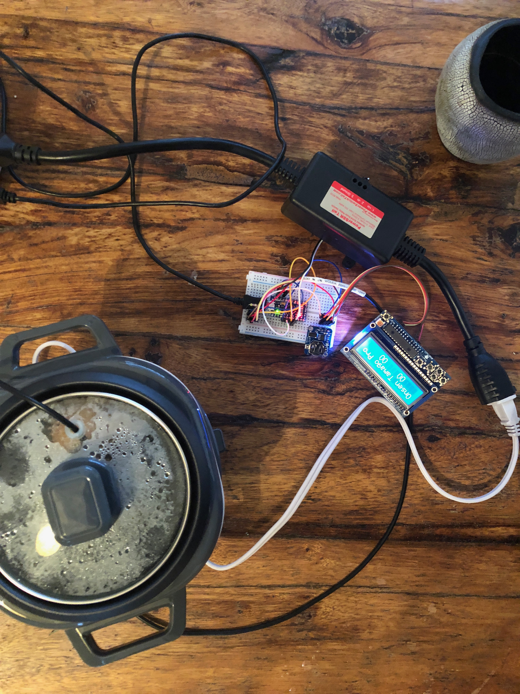

# Onsen Tamago Pro

# Instructions

{:class="img-responsive" width="800px"}

## 1. Place the PCBs in the protoboard. 

The white thing with all the holes is the "protoboard." It lets you make circuits without any soldering. Protoboards are especially handy because each row of 5 pins (two columns, one on each side) are all connected to each other. For example, pin # A1 is connected to B1, C1, D1, E1. And pin # F1 is connected to G1, H1, I1, J1. But F1 and A1 are not connected. And A1 and A2 are not connected. 

There are three PCBs for Onsen Tamago Pro (OTP.) They are:

 * **MCU**, the microcontroller, labeled "Pro Micro." It is the brains of the operation: it tells the display what to say, monitors the temperature and controls the rice cooker.
 * **CLOCK**, the thing with the little battery in it. It maintains the time, even when OTP is off. 
 * **DISPLAY**, the thing with the screen and buttons. 

There's also three other parts:

 * **COOKER**, the rice cooker.
 * **TAIL**, the "PowerSwitch Tail," which handles all the dangerous voltages so you never have to. It turns the rice cooker on and off.
 * **TEMP**, the temperature sensor. That's the long cable with the metal end and the three wires at the other end. It goes in the water.

Each PCB has already been assembled and all you need to do is wire them up together! Let's start with **MCU**.

Put the **MCU** on the board so that the USB jack is facing down, towards row 30. You want the right column of pins on **MCU** all up and down column G, and the left column along column C. Press until it's completely flush with the board. For example, the RAW pin on **MCU** should be seated in pin C30, and Pin 9 of **MCU** should be seated in pin G19. 

Put **CLOCK** on the board so that its GND pin is in pin H11, and SQW is in pin H15.

It should look like this:

{:class="img-responsive" width="800px"}

## Hook up the temperature sensor

**TEMP** has three wires coming out of it: red for voltage (5V, power), brown for ground (also written as GND, and acts as the relative "0" for voltage), and lastly a wire for data (which tells the **MCU** how hot it is.) Let's put those wires in the right place. 

Wire **TEMP**'s brown cable (GND) to pin J28 (**MCU**'s GND.)

Wire **TEMP**'s yellow cable to J1.

Wire **TEMP**'s red cable to J4. 

There's a small resistor in the box. It looks like a tiny bulb between two metal wires. (It may be poked into the protoboard for safe keeping in transit.) We need to wire up the resistor so that the temperatue sensor can talk the right voltage to **MCU**. Bend the resistor like a staple and put one metal wire in H1, and the other metal wire end in H4. We are adding the resistor between voltage and data of the sensor: if you remember, the protoboard connects across columns H and J.  Press the resistor all the way down. It should look like this:

{:class="img-responsive" width="800px"}

## Hook up jumper wires

Now we need to connect the various PCBs to each other. We are going to run wires between parts that need to talk to each other. Any color or length wire is fine!

**CLOCK**'s GND pin needs to be connected to **MCU**'s GND. That's a wire from G11 to I28.

**CLOCK**'s 5V pin needs to be connected to **MCU**'s VCC. That's a wire from G12 to B27.

**CLOCK**'s SDA pin needs to be connected to **MCU**'s SDA pin 2. That's a wire from G13 to J26.

**CLOCK**'s SCL pin needs to be connected to **MCU**'s SCL pin 3. That's a wire from G14 to J25.

**TEMP**'s data pin needs to be connected to **MCU**'s pin 4. That's a wire from G1 to J24.

**TEMP**'s voltage pin needs to be connected to 5V, so we'll tap into **CLOCK**'s voltage. That's G4 to F12.

Looks like this:

{:class="img-responsive" width="800px"}

## Wire the display

In the box are 4 wires bundled together that have a poky bit on one end and a receptacle on the other. Let's use those to make a cable between the display and the **MCU**.

Hold the display facing you, with the 5 buttons (arrow + select) facing on the bottom left. Count the pins on the bottom from the left and wire them like so.

 1. Don't connect
 2. Don't connect
 3. Hook up the red wire (5V)
 4. Don't connect
 5. Hook up the brown wire (GND)
 6. Don't connect
 7. (There is a space here, no pin)
 8. Don't connect
 9. Don't connect
 10. Don't connect
 11. Dont' connect
 12. Hook up the yellow wire (SDA)
 13. Hook up the orange wire (SCL)

Like this:

{:class="img-responsive" width="800px"}

Now hook the other ends of those 4 wires to the right spots on the **MCU**:

Wire the red cable (5V) to **MCU**'s VCC pin. That's red to A27.

Wire the brown cable (GND) to **MCU**'s GND. That brown to A29.

Wire the yellow cable (SDA) to **MCU**'s SDA / Pin 2. That's yellow to I26.

Wire the orange cable (SCL) to **MCU**'s SCL / Pin 3. Thats yellow to I25.

Like this:

{:class="img-responsive" width="800px"}

## Test the display, clock and temperature sensor.

You've wired most of it up, so let's take a break and test.

Plug the Belkin power strip into a wall or extension cable. Don't plug anything into its power plug, but plug the USB cable from it into the **MCU**'s USB port. 

The screen should light up saying "Onsen Tamago Pro"! After a few seconds, it should show a clock, the current preset, and the start time. The clock should be correct and moving.

If this **doesn't** happen, stop, check your work, and give Brian a call. 

If it did happen, _great!_. Now let's test the temperature sensor. Press the "up" arrow button on the 4-way button pad. The screen should turn red, say "Heating", and the number on the right should be showing the current temperature the sensor is detecting, in celsius. If it is just laying on the table, it should say 22 or so. Hold it in your hand or breathe on it that number should slowly go up. If that works, _great!_. If it doesn't, or the temperature says 85 or 0 or something weird, stop, check your work and call Brian.

{:class="img-responsive" width="800px"}

Unplug the USB cable from either end for your next and last step!

## Wire up the rice cooker.

The **COOKER** and **TAIL** need to be connected now. The **TAIL** has a big power plug in, and big power plug out, and then two small wires coming out of its side, one black, and one white. The small wires are the way the **MCU** tells the rice cooker to turn on and off. 

Wire the small white wire to pin J23 / **MCU** pin 5.

Wire the small black wire to pin J27 / **MCU** GND.

With the Belkin power strip unplugged, plug the big power plug from **TAIL** into the Belkin input. And plug the **COOKER**'s power cable into the **TAIL** input power plug. 

Fill the **COOKER** with an egg and enough water to cover the egg.

Run the **TEMP** sensor through that hole in top of **COOKER**. There's a little rubber gasket to help it stay in there. You want the metal part of the **TEMP** sensor fully submersed in the water but the top cover on. 

Make sure the **COOKER**'s "WARM/COOK" switch is pushed down. 

Make sure the USB cable is plugged into the Belkin power strip and the other end into the **MCU**.

Plug in the Belkin and the screen should turn on.

Now you're ready to make eggs!

{:class="img-responsive" width="800px"}

