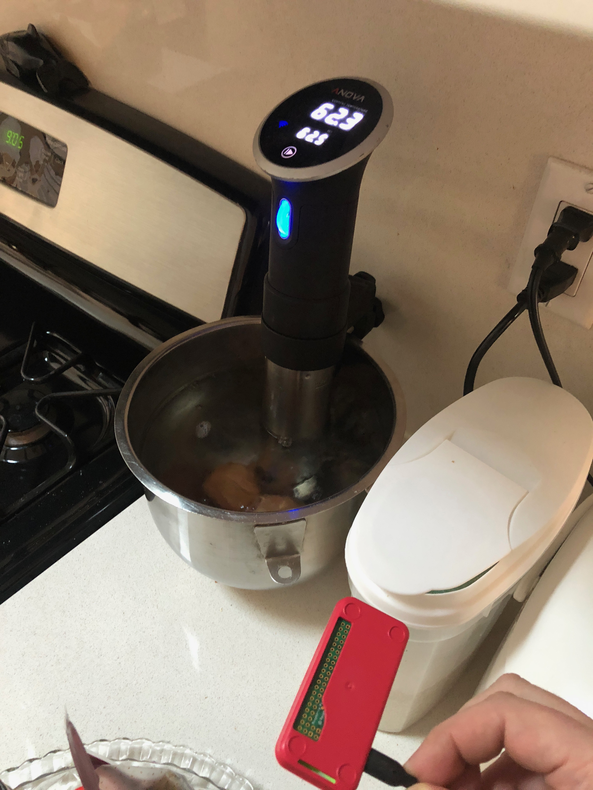

# Onsen Tamago the Easy Way 

 {:class="img-responsive" width="800px"}

If you are not ready to put together your own [custom Onsen Tamago Pro](http://onsentamago.pro), you can be almost as good with some easy to use store bought parts! Here's how

## What to buy or have

 * [An Anova Sous Vide circulator](https://www.amazon.com/Anova-Culinary-Precision-Bluetooth-Circulator/dp/B00UKPBXM4)
 * [A Raspberry Pi Zero W](https://www.amazon.com/CanaKit-Raspberry-Wireless-Official-Supply/dp/B071L2ZQZX). Get one with a case if you can, and a power supply, or use a USB power cable.
 * A pot of some sort that can hold the Anova on and some eggs.
 * Some eggs

## Install pycirculate on the Pi

Set up the Pi Zero so you can ssh into it. Install pycirculate:

```
sudo apt-get install libglib2.0-dev python-pip
pip install bluepy
pip install pycirculate
```

## Set up scripts to turn on, cool, and turn off the eggs every morning.

Turn on your anova and make sure it's close enough to the Pi. From the pi, run `sudo hcitool lescan`. Wait a bit until you see a number like `84:EB:18:02:xx:xx`. That is your address of the Anova. In the scripts below, make sure you copy it in.

Put this script called `egg_start.py` in your home folder:

```
from pycirculate.anova import AnovaController
anova = AnovaController("84:EB:18:02:xx:xx")
anova.set_timer(240)
anova.set_temp(62.5)
anova.start_anova()
```

Put this script called `egg_cool.py` in your home folder:

```
from pycirculate.anova import AnovaController
anova = AnovaController("84:EB:18:02:xx:xx")
anova.set_temp(54)
```

Put this script called `egg_stop.py` in your home folder:

```
from pycirculate.anova import AnovaController
anova = AnovaController("84:EB:18:02:xx:xx")
anova.stop_anova()
```

Run `crontab -e` to edit your crontab, and add these three lines

```
0 6 * * 1,2,3,4,5 python /home/pi/egg_start.py
0 7 * * 1,2,3,4,5 python /home/pi/egg_cool.py
0 10 * * 1,2,3,4,5 python /home/pi/egg_stop.py
```

## Eat eggs

Keep the Anova on with eggs in overnight, and enough water. At 6am it will start heating up to 62.5, then wait an hour, then go back down to 54 to keep warm for 3 hours, then shut off. Yum!


